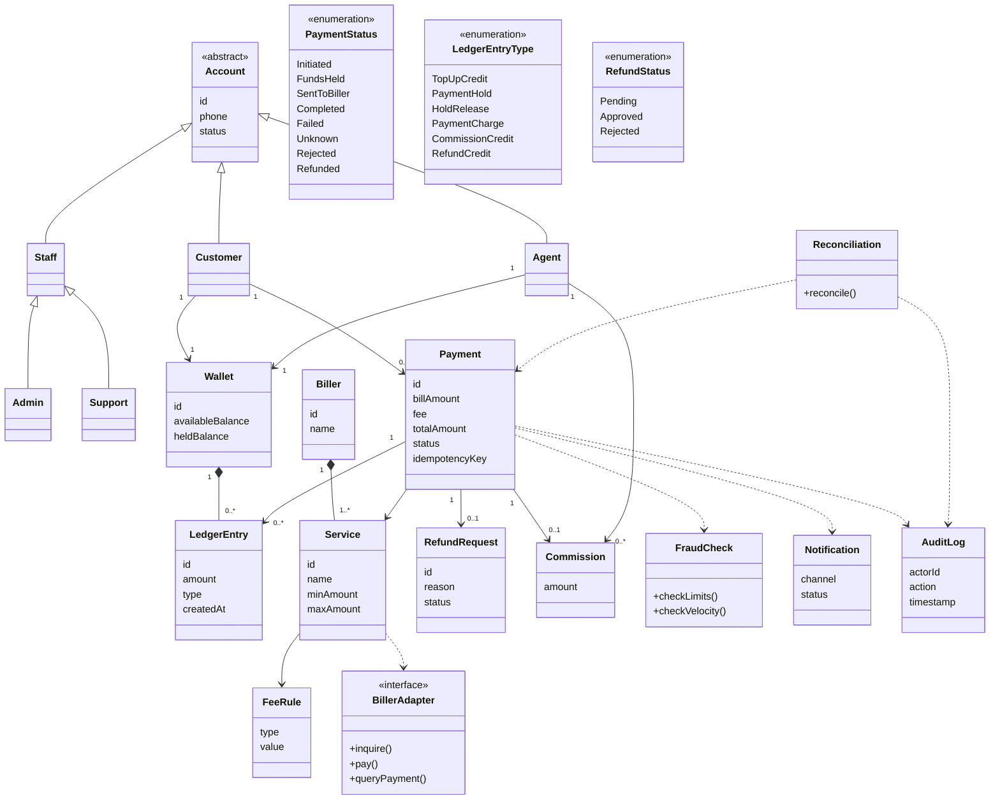

```mermaid

classDiagram
direction TB

class Account {
  <<abstract>>
  id
  phone
  status
}

class Customer
class Agent
class Staff
class Admin
class Support

class Wallet {
  id
  availableBalance
  heldBalance
}

class LedgerEntry {
  id
  amount
  type
  createdAt
}

class Biller {
  id
  name
}

class Service {
  id
  name
  minAmount
  maxAmount
}

class Payment {
  id
  billAmount
  fee
  totalAmount
  status
  idempotencyKey
}

class FeeRule {
  type
  value
}

class RefundRequest {
  id
  reason
  status
}

class Commission {
  amount
}

class FraudCheck {
  +checkLimits()
  +checkVelocity()
}

class BillerAdapter {
  <<interface>>
  +inquire()
  +pay()
  +queryPayment()
}

class Notification {
  channel
  status
}

class AuditLog {
  actorId
  action
  timestamp
}

class Reconciliation {
  +reconcile()
}

Account <|-- Customer
Account <|-- Agent
Account <|-- Staff
Staff <|-- Admin
Staff <|-- Support

Customer "1" --> "1" Wallet
Agent "1" --> "1" Wallet
Wallet "1" *-- "0..*" LedgerEntry

Biller "1" *-- "1..*" Service
Service --> FeeRule
Service ..> BillerAdapter

Customer "1" --> "0..*" Payment
Payment --> Service
Payment "1" --> "0..*" LedgerEntry
Payment "1" --> "0..1" RefundRequest
Payment "1" --> "0..1" Commission

Agent "1" --> "0..*" Commission

Payment ..> FraudCheck
Payment ..> Notification
Payment ..> AuditLog
Reconciliation ..> Payment
Reconciliation ..> AuditLog

class PaymentStatus {
  <<enumeration>>
  Initiated
  FundsHeld
  SentToBiller
  Completed
  Failed
  Unknown
  Rejected
  Refunded
}

class LedgerEntryType {
  <<enumeration>>
  TopUpCredit
  PaymentHold
  HoldRelease
  PaymentCharge
  CommissionCredit
  RefundCredit
}

class RefundStatus {
  <<enumeration>>
  Pending
  Approved
  Rejected
}

```