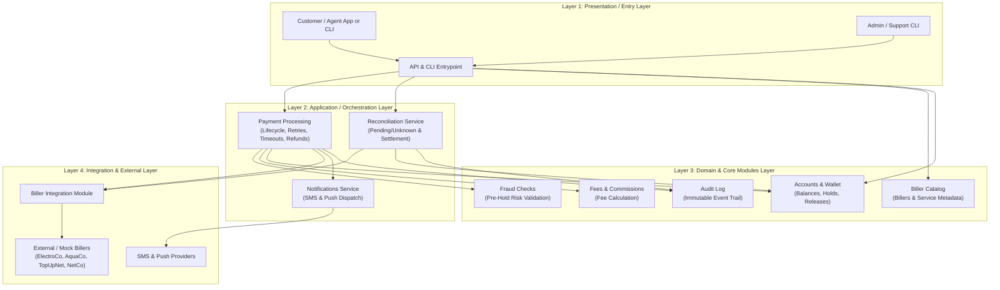

# PayLink Layered Architecture Diagram (Phase 1)

```mermaid
flowchart TB
    subgraph L1["Layer 1: Presentation / Entry Layer"]
        CustomerApp["Customer / Agent App or CLI"]
        AdminCli["Admin / Support CLI"]
        ApiGateway["API & CLI Entrypoint"]
    end

    subgraph L2["Layer 2: Application / Orchestration Layer"]
        PaymentSvc["Payment Processing<br/>(Lifecycle, Retries, Timeouts, Refunds)"]
        ReconSvc["Reconciliation Service<br/>(Pending/Unknown & Settlement)"]
        NotifySvc["Notifications Service<br/>(SMS & Push Dispatch)"]
    end

    subgraph L3["Layer 3: Domain & Core Modules Layer"]
        WalletMod["Accounts & Wallet<br/>(Balances, Holds, Releases)"]
        FraudMod["Fraud Checks<br/>(Pre-Hold Risk Validation)"]
        FeesMod["Fees & Commissions<br/>(Fee Calculation)"]
        CatalogMod["Biller Catalog<br/>(Billers & Service Metadata)"]
        AuditMod["Audit Log<br/>(Immutable Event Trail)"]
    end

    subgraph L4["Layer 4: Integration & External Layer"]
        BillerInt["Biller Integration Module"]
        Billers["External / Mock Billers<br/>(ElectroCo, AquaCo, TopUpNet, NetCo)"]
        MsgProviders["SMS & Push Providers"]
    end

    CustomerApp --> ApiGateway
    AdminCli --> ApiGateway

    ApiGateway --> PaymentSvc
    ApiGateway --> ReconSvc
    ApiGateway --> CatalogMod
    ApiGateway --> WalletMod

    PaymentSvc --> FraudMod
    PaymentSvc --> FeesMod
    PaymentSvc --> WalletMod
    PaymentSvc --> BillerInt
    PaymentSvc --> NotifySvc
    PaymentSvc --> AuditMod

    ReconSvc --> BillerInt
    ReconSvc --> WalletMod
    ReconSvc --> AuditMod

    NotifySvc --> MsgProviders
    BillerInt --> Billers
```
