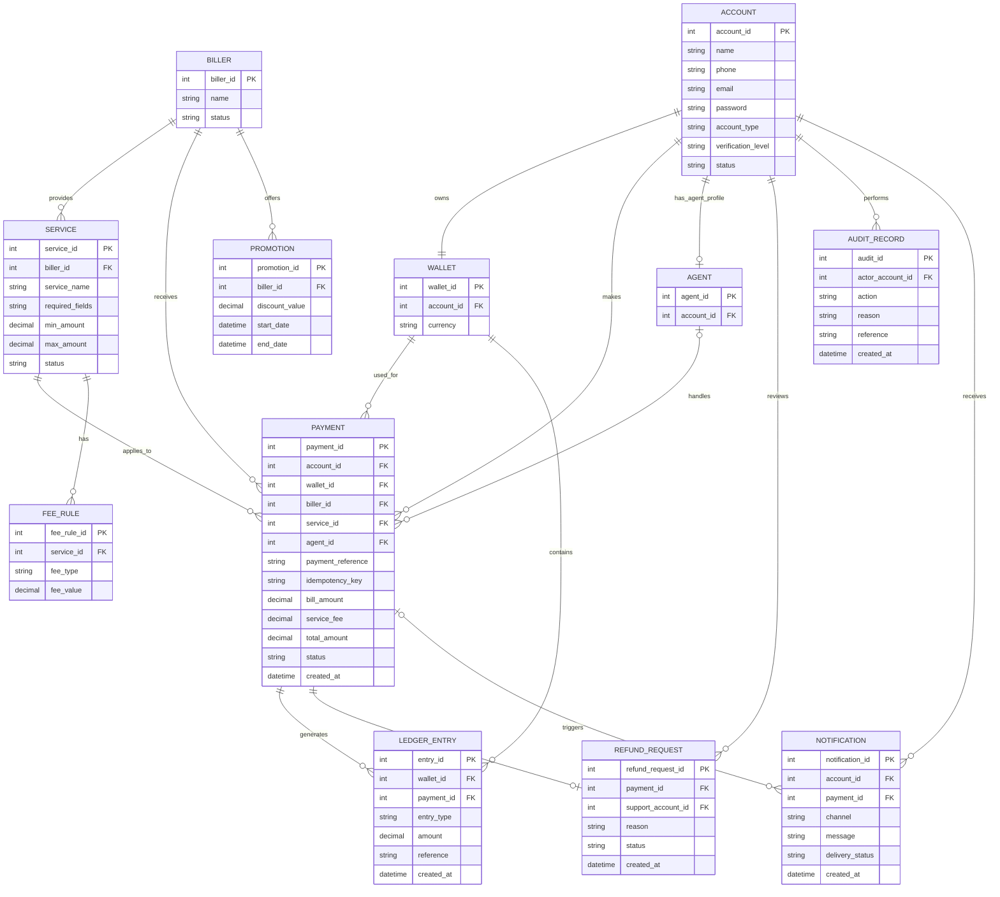

# ERD Diagram

```mermaid
    erDiagram
    ACCOUNT {
        int account_id PK
        string name
        string phone
        string email
        string password
        string account_type
        string verification_level
        string status
    }

    WALLET {
        int wallet_id PK
        int account_id FK
        string currency
    }

    LEDGER_ENTRY {
        int entry_id PK
        int wallet_id FK
        int payment_id FK
        string entry_type
        decimal amount
        string reference
        datetime created_at
    }
 
    PAYMENT {
        int payment_id PK
        int account_id FK
        int wallet_id FK
        int biller_id FK
        int service_id FK
        int agent_id FK
        string payment_reference
        string idempotency_key
        decimal bill_amount
        decimal service_fee
        decimal total_amount
        string status
        datetime created_at
    }

    BILLER {
        int biller_id PK
        string name
        string status
    }

    SERVICE {
        int service_id PK
        int biller_id FK
        string service_name
        string required_fields
        decimal min_amount
        decimal max_amount
        string status
    }

    AGENT {
        int agent_id PK
        int account_id FK
    }

    FEE_RULE {
        int fee_rule_id PK
        int service_id FK
        string fee_type
        decimal fee_value
    }

    PROMOTION {
        int promotion_id PK
        int biller_id FK
        decimal discount_value
        datetime start_date
        datetime end_date
    }

    REFUND_REQUEST {
        int refund_request_id PK
        int payment_id FK
        int support_account_id FK
        string reason
        string status
        datetime created_at
    }

    AUDIT_RECORD {
        int audit_id PK
        int actor_account_id FK
        string action
        string reason
        string reference
        datetime created_at
    }

    NOTIFICATION {
        int notification_id PK
        int account_id FK
        int payment_id FK
        string channel
        string message
        string delivery_status
        datetime created_at
    }

    ACCOUNT ||--|| WALLET : owns
    ACCOUNT ||--o{ PAYMENT : makes
    WALLET ||--o{ PAYMENT : used_for
    WALLET ||--o{ LEDGER_ENTRY : contains
    PAYMENT ||--o{ LEDGER_ENTRY : generates

    BILLER ||--o{ SERVICE : provides
    BILLER ||--o{ PAYMENT : receives
    SERVICE ||--o{ PAYMENT : applies_to
    SERVICE ||--o{ FEE_RULE : has
    BILLER ||--o{ PROMOTION : offers

    ACCOUNT ||--o| AGENT : has_agent_profile
    AGENT |o--o{ PAYMENT : handles

    PAYMENT ||--o| REFUND_REQUEST : may_have
    ACCOUNT ||--o{ REFUND_REQUEST : reviews

    ACCOUNT ||--o{ AUDIT_RECORD : performs
    ACCOUNT ||--o{ NOTIFICATION : receives
    PAYMENT |o--o{ NOTIFICATION : triggers
```