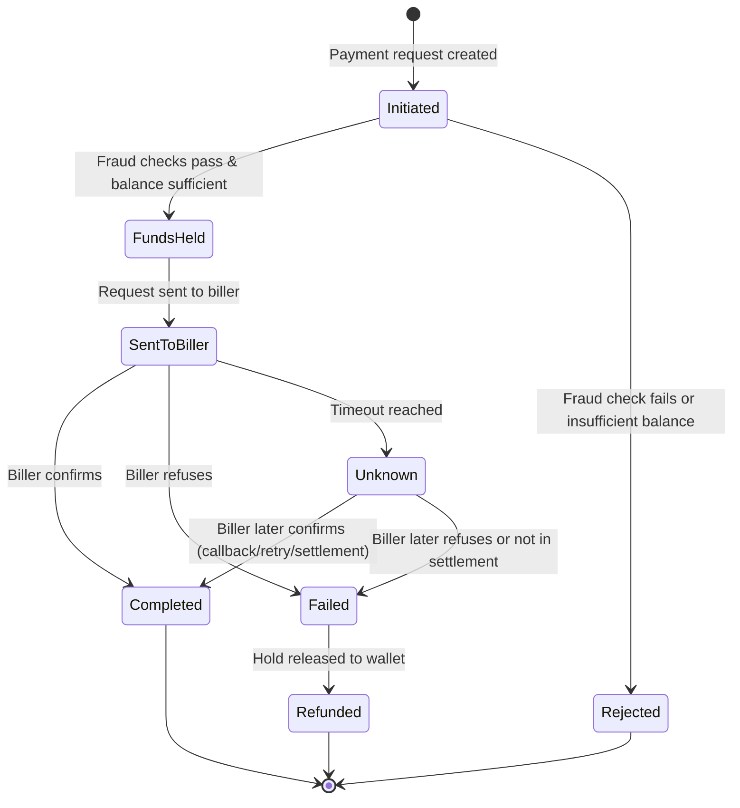

# Payment Life Cycle State Diagram

```mermaid
stateDiagram-v2
    [*] --> Initiated : Payment request created

    Initiated --> FundsHeld : Fraud checks pass & balance sufficient
    Initiated --> Rejected : Fraud check fails or insufficient balance

    FundsHeld --> SentToBiller : Request sent to biller

    SentToBiller --> Completed : Biller confirms
    SentToBiller --> Failed : Biller refuses
    SentToBiller --> Unknown : Timeout reached

    Unknown --> Completed : Biller later confirms (callback/retry/settlement)
    Unknown --> Failed : Biller later refuses or not in settlement

    Failed --> Refunded : Hold released to wallet

    Completed --> [*]
    Rejected --> [*]
    Refunded --> [*]
```