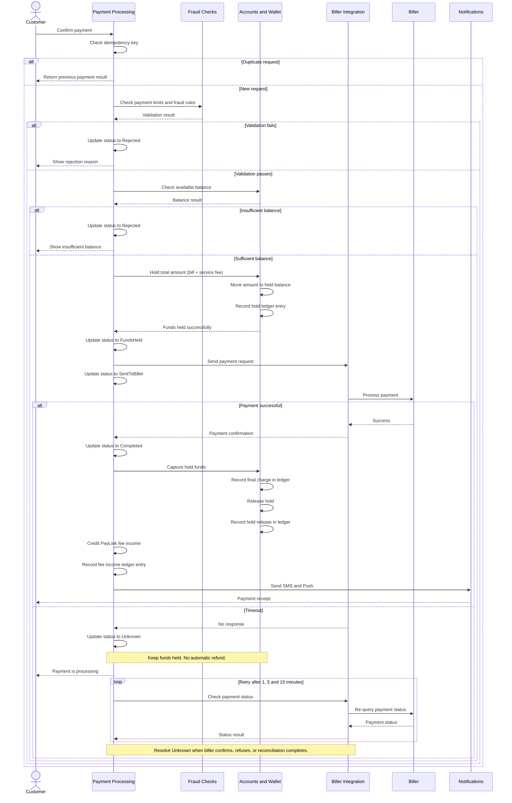

# Sequence Diagram – Pay a Bill

```mermaid
sequenceDiagram
    actor Customer
    participant PP as Payment Processing
    participant FC as Fraud Checks
    participant AW as Accounts and Wallet
    participant BI as Biller Integration
    participant B as Biller
    participant N as Notifications

    Customer->>PP: Confirm payment
    PP->>PP: Check idempotency key

    alt Duplicate request
        PP-->>Customer: Return previous payment result
    else New request
        PP->>FC: Check payment limits and fraud rules
        FC-->>PP: Validation result

        alt Validation fails
            PP->>PP: Update status to Rejected
            PP-->>Customer: Show rejection reason

        else Validation passes
            PP->>AW: Check available balance
            AW-->>PP: Balance result

            alt Insufficient balance
                PP->>PP: Update status to Rejected
                PP-->>Customer: Show insufficient balance

            else Sufficient balance
                PP->>AW: Hold total amount (bill + service fee)
                AW->>AW: Move amount to held balance
                AW->>AW: Record hold ledger entry
                AW-->>PP: Funds held successfully

                PP->>PP: Update status to FundsHeld
                PP->>BI: Send payment request
                PP->>PP: Update status to SentToBiller
                BI->>B: Process payment

                alt Payment successful
                    B-->>BI: Success
                    BI-->>PP: Payment confirmation
                    PP->>PP: Update status to Completed
                    PP->>AW: Capture held funds
                    AW->>AW: Record final charge in ledger
                    AW->>AW: Release hold
                    AW->>AW: Record hold release in ledger
                    PP->>PP: Credit PayLink fee income
                    PP->>PP: Record fee income ledger entry
                    PP->>N: Send SMS and Push
                    N-->>Customer: Payment receipt

                else Timeout
                    BI-->>PP: No response
                    PP->>PP: Update status to Unknown
                    Note over PP,AW: Keep funds held. No automatic refund.
                    PP-->>Customer: Payment is processing

                    loop Retry after 1, 5 and 15 minutes
                        PP->>BI: Check payment status
                        BI->>B: Re-query payment status
                        B-->>BI: Payment status
                        BI-->>PP: Status result
                    end

                    Note over PP,BI: Resolve Unknown when biller confirms, refuses, or reconciliation completes.
                end
            end
        end
    end
```