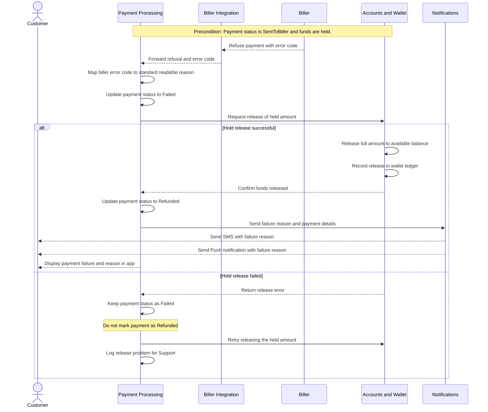

# Sequence Diagram – Refund a Failed Payment

```mermaid
    sequenceDiagram
    actor Customer
    participant PP as Payment Processing
    participant BI as Biller Integration
    participant B as Biller
    participant AW as Accounts and Wallet
    participant N as Notifications

    Note over PP,AW: Precondition: Payment status is SentToBiller and funds are held.

    B-->>BI: Refuse payment with error code
    BI-->>PP: Forward refusal and error code

    PP->>PP: Map biller error code to standard readable reason
    PP->>PP: Update payment status to Failed

    PP->>AW: Request release of held amount

    alt Hold release successful
        AW->>AW: Release full amount to available balance
        AW->>AW: Record release in wallet ledger
        AW-->>PP: Confirm funds released

        PP->>PP: Update payment status to Refunded
        PP->>N: Send failure reason and payment details
        N-->>Customer: Send SMS with failure reason
        N-->>Customer: Send Push notification with failure reason
        PP-->>Customer: Display payment failure and reason in app

    else Hold release failed
        AW-->>PP: Return release error
        PP->>PP: Keep payment status as Failed
        Note over PP: Do not mark payment as Refunded
        PP->>AW: Retry releasing the held amount
        PP->>PP: Log release problem for Support
    end
```